## Description

A step-by-step implementation of the LTFT-ERP algorithm and the associated procedures 
described in "A Study of Longitudinal Trends in Time-Frequency Transformations of 
EEG Data during a Learning Experiment" by Boland et al. (2021). This procedure assumes
that the data is densely observed in the functional dimension.

## Functions Implemented
LTFT.ERP_simulateTFT.R, LTFT.ERP_MDPCA.R, LTFT.ERP_MixedEffectsModel.R, filledcontour3.R,
filled.legend.R, LTFT.ERP_MTFT.ERP_reshape.R (referenced)

## Tutorial Outline
0. MTFT-ERP utilizing wavelets and reshaping the TFT surfaces (LTFT.ERP_MTFT.ERP_reshape.R)  
1. Simulate power vector data (LTFT.ERP_simulateTFT.R)
2. Dimension reduction via MDPCA (LTFT.ERP_MDPCA.R)
3. Mixed effects modeling of MDPCA scores (LTFT.ERP_mixedEffectsModel.R)
4. Calculation of ME and PE values 
5.Visualization of simulation results


```r
# Install missing packages
list.of.packages <- c("data.table", "rio", "splines", "viridis", "ggplot2", "kableExtra")
new.packages <- list.of.packages[!(list.of.packages %in% installed.packages()[,"Package"])]
if(length(new.packages)) install.packages(new.packages) 

# Load packages
library(data.table)
library(rio)
library(splines)
library(viridis)
library(ggplot2)
library(kableExtra)

# Load in R code
source("LTFT.ERP_simulateTFT.R")
source("LTFT.ERP_MTFT.ERP_reshape.R")
source("LTFT.ERP_MDPCA.R")
source("LTFT.ERP_mixedEffectsModel.R")
source("filledcontour3.R")
source("filled.legend.R")
```

filledcontour3.R and filled.legend.R are scripts modified from Carey McGilliard,
Bridget Ferris, and Ian Taylor. Special thanks to their contribution.

## 0. MTFT-ERP utilizing wavelets and reshaping the TFT surfaces

Step 1 and Step 2 of the algorithm are detailed in the R script: LTFT.ERP_MTFT.ERP_reshape.R 

## 1. Simulate power vector data


```r
# Import empirical model estimates
load("LTFT.ERP_simulateTFT_empirical.estimates.Rda") # (list, length = 5)
Phi <- empirical.estimates$Phi # Estimated leading eigenvectors (matrix)
X.Mean <- empirical.estimates$X.Mean # Average power vector (vector)
fixed.effects <- empirical.estimates$fixed.effects # Fixed effects estimates (list)
random.effects <- empirical.estimates$random.effects # Random effects estimates (list)
MissProf <- empirical.estimates$MissProf # Missingness profile (data.frame)

N.group <- 40 # group (ASD/TD) sample size (N = 2 * N.group)
SNR <- 0.4 # Signal-to-noise ratio

# NOTE: Simulating the data will take approximately 2 minutes for the sample size N = 80 (N.group = 40)

# Simulate delta frequency TFT power vectors using empirical estimates from motivating data 
Sim.Data <- LTFT.ERP_simulateTFT(N.group = 40, # (LTFT.ERP_simulateTFT.R)
                                SNR = 0.4, 
                                freq = "Delta", 
                                H = 6,  
                                n.spline = 4,
                                f_tot = 28,
                                d_tot = 63,
                                s = 5:80,
                                MissProf = MissProf,
                                X.Mean = X.Mean, 
                                Phi = Phi,
                                fixed.effects = fixed.effects,
                                random.effects = random.effects) 
```

## 2. Dimension reduction via MDPCA


```r
# NOTE: Performing MDPCA will take approximately 1.5 minutes for the sample size N = 80

# Perform MDPCA for dimension reduction (LTFT.ERP_MDPCA.R)
MDPCA.Sim <- LTFT.ERP_MDPCA(X.data = Sim.Data$X.Sim,
                            m = 1764,
                            s = 5:80,
                            H = 6,
                            k = 30,
                            s.set = seq(5, 80, by = 3))
```

```
## [1] "1. Calculate average power vector (completed)"
## [1] "2. Trial-specific covariance calculation (completed)"
## [1] "3. Calculate marginal covariance (completed)"
## [1] "4. Calculate MDPCA scores (completed)"
```

## 3. Mixed effects modeling of MDPCA scores


```r
# Format data.frame of the estimated MDPCA scores returned from the MTFT.ERP_MDPCA
# function as specified by the Scores argument detailed in LTFT.ERP_MixedEffectsModel.R
Scores.Sim <- MDPCA.Sim$Scores # Obtain data.frame of estimated scores
Scores.Sim$group <- if_else(Scores.Sim$id %in% 1:N.group, "TD", "ASD") # Create group (ASD/TD) variable
Scores.Sim <- inner_join(Scores.Sim, # Create region variable from missingness profile
                         unique(MissProf[, c("electrode", "region")]),
                         by = "electrode")
Scores.Sim$lobe <- if_else(Scores.Sim$region %in% c("RF", "ZF", "LF"), # Create scalp section variable
                           "Frontal", "Posterior")
Scores.Sim <- Scores.Sim[, c("id", "electrode", "trial", "condition", "region", # Format variables in correct order
                             "group", "lobe", "scores1", "scores2", "scores3",
                             "scores4", "scores5", "scores6")]

# Note: Performing the mixed effects model will take approximately 1 minute
#       for the sample size N = 40

# Fit mixed effects model for MDPCA scores
fit.Sim <- LTFT.ERP_mixedEffectsModel(Scores = Scores.Sim, # (LTFT.ERP_MixedEffectsModel.R)
                                      H = 6,
                                      s = 5:80,
                                      reControl = list(maxIter=1000,
                                                       msMaxIter=1000,
                                                       msVerbose=TRUE,
                                                       opt = "optim"))
```

```
## initial  value 1562657.963471 
## final  value 1562657.499468 
## converged
## initial  value 1541918.896568 
## final  value 1541917.554465 
## converged
## initial  value 1523536.881336 
## final  value 1523535.936087 
## converged
## initial  value 1505433.376601 
## final  value 1505431.195406 
## converged
## initial  value 1487469.733823 
## final  value 1487467.027096 
## converged
## initial  value 1476739.377850 
## final  value 1476731.727476 
## converged
```

## 4. Calculate ME and PE values


```r
# Load dataset containing the stimulated true mean and predicted MDPCA score trajectories
Scores.true <- Sim.Data$Scores.Sim.pre

# a. Calculate ME values for leading eigenvector and mean TFT power vector

# Calculate ME for the mean TFT power vector
ME.MeanPower <- sum(abs(X.Mean - MDPCA.Sim$X.Mean))/sum(abs(X.Mean))

# Calculate ME for the Eigenvector
PC1.est <- MDPCA.Sim$Phi[,1] # Estimated eigenvector, \hat{\phi_1}
if(PC1.est[1] > 0){ # Check alignment of eigenvector
  PC1.est <- -1*PC1.est
}
ME.Eigenvector <- sum(abs(Phi[,1] - PC1.est))/sum(abs(Phi[,1])) # Calculate ME

# b. Calculate total and group ME and PE values for MDPCA Scores

# Function for calculating ME and PE of MDPCA Scores
ME.PE.calc <- function(Scores.true,  # data.frame that is the first element of the list returned from the
                                     # LTFT.ERP_simulateTFT function (data.frame)
                       fit.est,      # list of mixed effects model estimates returned from the LTFT.ERP_MixedEffectsModel function (list)
                       N,            # sample size (scalar, N.group * 2)
                       n.spline = 4, # number of spline knots used in modeling longitudinal trends. Default n.spline = 4 (scalar)
                       SNR           # signal-to-noise ratio (SNR), (scalar)
                       ){

  # a. Obtain model estimates (fixed and random effects)

  # Determine indices
  i <- sort(unique(Scores.true$id)) # Subject id, i \in {1,...,2*N.group}
  r <- sort(unique(Scores.true$region)) # Eletrode region ID, r \in {1,...,R}
  s <- sort(unique(Scores.true$trial)) # Trial, s \in {s_{min},...,S}

  # Estimated Fixed effects, \hat{B^1} (40 x 1)
  b <- fit.est$B[[1]]

  # Estimated Subject-specific random effects, \hat{b^1_i} (length(i) x (n.spline + 1))
  bi <- as.data.frame(fit.est$bi[[1]])
  bi$id <- i
  names(bi) <- c("bi.Intercept", "bi.spline1", "bi.spline2",
                 "bi.spline3", "bi.spline4", "id")

  # Estimated subject- and region-specific random effects, \hat{b^1_ir} ((length(i) x length(r)) x (n.spline + 1))
  bir <- as.data.frame(fit.est$bir[[1]])
  bir$id <- rep(i, each = length(r))
  bir$region <- rep(r, length(i))
  names(bir) <- c("bir.Intercept", "bir.spline1",
                  "bir.spline2", "bir.spline3", "bir.spline4", "id", "region")

  # b. Format data containing true MDPCA score trajectories

  # Merge estimated random effects to data
  Scores.true <- inner_join(Scores.true, bi, by = "id")
  Scores.true <- inner_join(Scores.true, bir, by = c("id", "region"))

  # Create spline basis and merge by trial
  spline <- as.data.frame(cbind(s, ns(s, df = n.spline)))
  names(spline) <- c("trial", paste("spline", 1:n.spline, sep = ""))
  splines <- names(spline)[-1] # Names of spline fixed effects variables
  Scores.true <- inner_join(Scores.true, spline, by = "trial") # Merge splines and scores by trial

  # Format subgroup model variables
  Scores.true$condition <- if_else(Scores.true$condition == "Expected", 0, 1)

  # c. Calculate estimated mean MDPCA scores trajectories

  # Create fixed effects design matrix
  Q <- Scores.true %>% # Select key variables
    select(spline1, spline2, spline3, spline4, group, condition, lobe)
  Q <- cbind("(Inctercept)" = 1, Q) # Intercept variable
  Q <- Q %>% # Define interaction terms
    mutate(V9 = group * condition, V10 = group * lobe, V11 = condition * lobe,
           V12 = spline1 * group, V13 = spline2 * group, V14 = spline3 * group,
           V15 = spline4 * group, V16 = spline1 * condition, V17 = spline2 * condition,
           V18 = spline3 * condition, V19 = spline4 * condition, V20 = spline1 * lobe,
           V21 = spline2 * lobe, V22 = spline3 * lobe, V23 = spline4 * lobe,
           V24 = group * condition * lobe, V25 = spline1 * group * condition,
           V26 = spline2 * group * condition, V27 = spline3 * group * condition,
           V28 = spline4 * group * condition, V29 = spline1 * group * lobe,
           V30 = spline2 * group * lobe, V31 = spline3 * group * lobe,
           V32 = spline4 * group * lobe, V33 = spline1 * condition * lobe,
           V34 = spline2 * condition * lobe, V35 = spline3 * condition * lobe,
           V36 = spline4 * condition * lobe,
           V37 = spline1 * group * condition * lobe,
           V38 = spline2 * group * condition * lobe,
           V39 = spline3 * group * condition * lobe,
           V40 = spline4 * group * condition * lobe)
  Q <- as.matrix(Q) # Format as matrix

  # Calculate estimated mean MDPCA score trajectories, E[Y^1_{ij(r)l}(s)]
  Scores.true$mean.est <- tcrossprod(Q, t(as.matrix(b))) # (vector)

  # d. Calculate estimated subject- and region-specific longitudinal MDPCA score trajectories
  Scores.true <- Scores.true %>%  # Mutate creates a new variable in data.frame
    mutate(pred.est = mean.est + bi.Intercept +  # Estimated MDPCA score trajectories, \hat{E[Y_{ij(r)l}^1(s)|b_i^1, b_{ir}^1]}
             (bi.spline1 * spline1) + (bi.spline2 * spline2) +
             (bi.spline3 * spline3) + (bi.spline4 * spline4) + bir.Intercept +
             (bir.spline1 * spline1) + (bir.spline2 * spline2) +
             (bir.spline3 * spline3) + (bir.spline4 * spline4))

  # Format data for ME and PE calculations of MDPCA Scores
  Scores.true$condition <- factor(if_else(Scores.true$condition == 0, "Expected", "Unexpected"))
  Scores.true$region <- factor(Scores.true$region)
  Scores.true$group <- factor(if_else(Scores.true$group == 0, "ASD", "TD"))
  Scores.true$lobe <- factor(if_else(Scores.true$lobe == 0, "Frontal", "Posterior"))
  Scores.true <- Scores.true %>%
    mutate(mean.true = fixed.scores1, # Rename variables
           pred.true = scores1) %>%
    select(group, condition, lobe, mean.true, mean.est, pred.true, pred.est, id, region, trial) %>%
    distinct()
  Scores.true <- as.data.table(Scores.true)

  # Calculate overall ME
  ME.total <- Scores.true %>%
    select(mean.true, mean.est) %>%
    distinct() %>% # Obtain unique rows
    dplyr::summarize(ME = sum(abs(mean.true - mean.est))/sum(abs(mean.true))) %>% # Overall ME calculation
    mutate(N = 2*N.group, SNR = SNR) %>%
    data.frame()

  # Calculate overall PE
  PE.total <- Scores.true %>%
    select(pred.true, pred.est) %>%
    distinct() %>%
    dplyr::summarize(PE = sum(abs(pred.true - pred.est))/sum(abs(pred.true))) %>% # Overall PE calculation
    mutate(N = 2*N.group, SNR = SNR) %>%
    data.frame()

  # Merge ME and PE values into one data frame
  ME.PE.total.a <- inner_join(ME.total, PE.total, by = c("N", "SNR"))

  # The direction of the eigenvector is not identifiable through MDCPCA. Therefore,
  # the ME and PE scores need to be calculated in both directions and aligned. The
  # correct direction will have both the lower ME and PE values.
  Scores.true$mean.est <- Scores.true$mean.est * -1
  Scores.true$pred.est <- Scores.true$pred.est * -1

  # Calculate overall ME and PE in after changing direction of the eigenvector
  ME.total <- Scores.true %>% # Calculate ME
    select(mean.true, mean.est) %>%
    distinct() %>%
    dplyr::summarize(ME = sum(abs(mean.true - mean.est))/sum(abs(mean.true))) %>% # Overall ME calculation
    mutate(N = 2*N.group, SNR = SNR) %>%
    data.frame()
  PE.total <- Scores.true %>% # Calculate PE
    select(pred.true, pred.est) %>%
    distinct() %>%
    dplyr::summarize(PE = sum(abs(pred.true - pred.est))/sum(abs(pred.true))) %>% # Overall PE calculation
    mutate(N = 2*N.group, SNR = SNR) %>%
    data.frame()
  ME.PE.total.b <- inner_join(ME.total, PE.total, by = c("N", "SNR")) # Merge ME and PE values

  # Determine and (if necessary) fix the ME and PE estimates to the correct alignment
  if(ME.PE.total.a$ME < ME.PE.total.b$ME & ME.PE.total.a$PE < ME.PE.total.b$PE){
    Scores.true$mean.est <- Scores.true$mean.est * -1
    Scores.true$pred.est <- Scores.true$pred.est * -1
    ME.PE.total <- ME.PE.total.a} else {
      ME.PE.total <- ME.PE.total.b
    }

  # Calculate the ME and PE values for model subgroups (condition, lobe, group)
  ME.group <- Scores.true %>% # ME estimates
    select(group, condition, lobe, mean.true, mean.est) %>%
    distinct() %>%
    group_by(group, condition, lobe) %>% # Condition by group, condition, and scalp section
    summarise(ME = sum(abs(mean.true - mean.est))/sum(abs(mean.true))) %>% # Calculate group-level ME values
    mutate(N = 2*N.group, SNR = SNR) %>%
    data.frame()
  PE.group <- Scores.true %>% # PE estimates
    select(group, condition, lobe, trial, id, region, pred.true, pred.est) %>%
    distinct() %>%
    group_by(group, condition, lobe) %>% # Condition by group, condition, and scalp section
    dplyr::summarize(PE = sum(abs(pred.true - pred.est))/sum(abs(pred.true))) %>% # Calculate group-level PE values
    mutate(N = 2*N.group, SNR = SNR) %>%
    data.frame()

  # Data frame of ME and PE values
  ME.PE <- inner_join(ME.group, PE.group, by = c("group", "condition", "lobe", "N", "SNR"))

  return(list(ME.PE, ME.PE.total))

}

# Calculate total and group ME and PE values for MDPCA Scores
ME.PE <- ME.PE.calc(Scores.true = Scores.true,
                    fit.est = fit.Sim,
                    N = 2 * N.group,
                    n.spline = 4,
                    SNR = 0.4)
ME.PE.Total <- ME.PE[[2]] # Overall ME and PE for MDPCA Scores
ME.PE.Group <- ME.PE[[1]] # Group-specific ME and PE for MDPCA Scores

# Display Overall ME and PE table
ME.PE.Total <- round(cbind(ME.MeanPower, ME.Eigenvector,  ME.PE[[2]]), 3)
ME.PE.Total <- ME.PE.Total[, c(4, 5, 1, 2, 3, 6)]
names(ME.PE.Total) <- c("N", "SNR", "ME", "ME", "ME", "PE")
kbl(ME.PE.Total, align = c("l", "c", "c", "c", "c", "c"),
    caption = "Overall ME and PE Table") %>%
  kable_classic_2(full_width = T) %>%
  add_header_above(c(" " = 2, "Mean Power" = 1, "Eigenvector" = 1, "MDPCA Scores" = 2))
```

<table class=" lightable-classic-2" style='font-family: "Arial Narrow", "Source Sans Pro", sans-serif; margin-left: auto; margin-right: auto;'>
<caption>Overall ME and PE Table</caption>
 <thead>
<tr>
<th style="empty-cells: hide;" colspan="2"></th>
<th style="padding-bottom:0; padding-left:3px;padding-right:3px;text-align: center; " colspan="1"><div style="border-bottom: 1px solid #111111; margin-bottom: -1px; ">Mean Power</div></th>
<th style="padding-bottom:0; padding-left:3px;padding-right:3px;text-align: center; " colspan="1"><div style="border-bottom: 1px solid #111111; margin-bottom: -1px; ">Eigenvector</div></th>
<th style="padding-bottom:0; padding-left:3px;padding-right:3px;text-align: center; " colspan="2"><div style="border-bottom: 1px solid #111111; margin-bottom: -1px; ">MDPCA Scores</div></th>
</tr>
  <tr>
   <th style="text-align:left;"> N </th>
   <th style="text-align:center;"> SNR </th>
   <th style="text-align:center;"> ME </th>
   <th style="text-align:center;"> ME </th>
   <th style="text-align:center;"> ME </th>
   <th style="text-align:center;"> PE </th>
  </tr>
 </thead>
<tbody>
  <tr>
   <td style="text-align:left;"> 80 </td>
   <td style="text-align:center;"> 0.4 </td>
   <td style="text-align:center;"> 0.805 </td>
   <td style="text-align:center;"> 0.874 </td>
   <td style="text-align:center;"> 0.362 </td>
   <td style="text-align:center;"> 0.522 </td>
  </tr>
</tbody>
</table>

```r
# Display ME and PE table by subgroup
ME.PE.Group <- ME.PE[[1]] # Group-specific ME and PE for MDPCA Scores
ME.Group <- round(ME.PE.Group$ME, 3)
PE.Group <- round(ME.PE.Group$PE, 3)
ME.PE.Group <- ME.PE.Group[, c(5, 6, 1, 2, 3, 4, 7)]
ME.ASD <- cbind(ME.PE.Group[1, c(3, 1, 2)], t(ME.Group[c(1, 3, 2, 4)])) # Format group-specific tables
PE.ASD <- cbind(ME.PE.Group[1, c(3, 1, 2)], t(PE.Group[c(1, 3, 2, 4)]))
ME.TD <- cbind(ME.PE.Group[5, c(3, 1, 2)], t(ME.Group[c(5, 7, 6, 8)]))
PE.TD <- cbind(ME.PE.Group[5, c(3, 1, 2)], t(PE.Group[c(5, 7, 6, 8)]))
names(ME.ASD) <- c("Group", "N", "SNR", "Expected", "Unexpected", "Expected", "Unexpected")
names(PE.ASD) <- c("Group", "N", "SNR", "Expected", "Unexpected", "Expected", "Unexpected")
names(ME.TD) <- c("Group", "N", "SNR", "Expected", "Unexpected", "Expected", "Unexpected")
names(PE.TD) <- c("Group", "N", "SNR", "Expected", "Unexpected", "Expected", "Unexpected")
ME.Group <- data.table(rbind(ME.ASD, ME.TD))
PE.Group <- data.table(rbind(PE.ASD, PE.TD))
kbl(ME.Group, align = "c", caption = "ME of MDPCA Scores") %>%
  kable_classic_2(full_width = T) %>%
  add_header_above(c(" " = 3, "Frontal" = 2, "Posterior" = 2))
```

<table class=" lightable-classic-2" style='font-family: "Arial Narrow", "Source Sans Pro", sans-serif; margin-left: auto; margin-right: auto;'>
<caption>ME of MDPCA Scores</caption>
 <thead>
<tr>
<th style="empty-cells: hide;" colspan="3"></th>
<th style="padding-bottom:0; padding-left:3px;padding-right:3px;text-align: center; " colspan="2"><div style="border-bottom: 1px solid #111111; margin-bottom: -1px; ">Frontal</div></th>
<th style="padding-bottom:0; padding-left:3px;padding-right:3px;text-align: center; " colspan="2"><div style="border-bottom: 1px solid #111111; margin-bottom: -1px; ">Posterior</div></th>
</tr>
  <tr>
   <th style="text-align:center;"> Group </th>
   <th style="text-align:center;"> N </th>
   <th style="text-align:center;"> SNR </th>
   <th style="text-align:center;"> Expected </th>
   <th style="text-align:center;"> Unexpected </th>
   <th style="text-align:center;"> Expected </th>
   <th style="text-align:center;"> Unexpected </th>
  </tr>
 </thead>
<tbody>
  <tr>
   <td style="text-align:center;"> ASD </td>
   <td style="text-align:center;"> 80 </td>
   <td style="text-align:center;"> 0.4 </td>
   <td style="text-align:center;"> 0.581 </td>
   <td style="text-align:center;"> 0.705 </td>
   <td style="text-align:center;"> 0.390 </td>
   <td style="text-align:center;"> 0.284 </td>
  </tr>
  <tr>
   <td style="text-align:center;"> TD </td>
   <td style="text-align:center;"> 80 </td>
   <td style="text-align:center;"> 0.4 </td>
   <td style="text-align:center;"> 0.162 </td>
   <td style="text-align:center;"> 0.209 </td>
   <td style="text-align:center;"> 0.474 </td>
   <td style="text-align:center;"> 0.698 </td>
  </tr>
</tbody>
</table>

```r
kbl(PE.Group, align = "c", caption = "PE of MDPCA Scores") %>%
  kable_classic_2(full_width = T) %>%
  add_header_above(c(" " = 3, "Frontal" = 2, "Posterior" = 2))
```

<table class=" lightable-classic-2" style='font-family: "Arial Narrow", "Source Sans Pro", sans-serif; margin-left: auto; margin-right: auto;'>
<caption>PE of MDPCA Scores</caption>
 <thead>
<tr>
<th style="empty-cells: hide;" colspan="3"></th>
<th style="padding-bottom:0; padding-left:3px;padding-right:3px;text-align: center; " colspan="2"><div style="border-bottom: 1px solid #111111; margin-bottom: -1px; ">Frontal</div></th>
<th style="padding-bottom:0; padding-left:3px;padding-right:3px;text-align: center; " colspan="2"><div style="border-bottom: 1px solid #111111; margin-bottom: -1px; ">Posterior</div></th>
</tr>
  <tr>
   <th style="text-align:center;"> Group </th>
   <th style="text-align:center;"> N </th>
   <th style="text-align:center;"> SNR </th>
   <th style="text-align:center;"> Expected </th>
   <th style="text-align:center;"> Unexpected </th>
   <th style="text-align:center;"> Expected </th>
   <th style="text-align:center;"> Unexpected </th>
  </tr>
 </thead>
<tbody>
  <tr>
   <td style="text-align:center;"> ASD </td>
   <td style="text-align:center;"> 80 </td>
   <td style="text-align:center;"> 0.4 </td>
   <td style="text-align:center;"> 0.602 </td>
   <td style="text-align:center;"> 0.607 </td>
   <td style="text-align:center;"> 0.511 </td>
   <td style="text-align:center;"> 0.459 </td>
  </tr>
  <tr>
   <td style="text-align:center;"> TD </td>
   <td style="text-align:center;"> 80 </td>
   <td style="text-align:center;"> 0.4 </td>
   <td style="text-align:center;"> 0.493 </td>
   <td style="text-align:center;"> 0.511 </td>
   <td style="text-align:center;"> 0.530 </td>
   <td style="text-align:center;"> 0.499 </td>
  </tr>
</tbody>
</table>

## 5. Visualization of simulation results

### a. Mean power vector plot


```r
# The following function was modified from the WaveletTransform function found in the
# WaveletComp package. For an in-depth explanation of details involved in the wavelet
# transformation utilized in this function, please refer to the WaveletComp documentation.

# Function to plot mean power vector
PowerMean.plot <- function(X.mean, # Mean Power Vector, X (vector, m x 1)
                           b_d,    # translation (time) parameteres (vector, D x 1)
                           freq,   # Frequency band (Delta, Theta, Alpha, Beta, Gamma) (character)
                           d_tot,  # Total number of translation (time) parameters (scalar), D
                           f_tot   # Total number of scale (frequency) parameters (scalar), F
                           ){

  # Determine the scale parameters
  max_freq <- ifelse(freq == "Delta" | freq == "Theta", 12,
                     ifelse(freq == "Alpha", 16, ifelse(freq == "Beta", 32, 64)))
  lowerPeriod <- 1/max_freq
  upperPeriod <- 1/0.5
  omega0 <- 6 # Angular frequency
  fourier.factor <- (2 * pi)/omega0
  min.scale <- lowerPeriod/fourier.factor
  max.scale <- upperPeriod/fourier.factor
  J <- f_tot - 1
  p <- ceiling((J/log2(max.scale/min.scale)*2))/2
  dj <- 1/p
  scales <- min.scale * 2^((0:J) * dj)
  periods <- fourier.factor * scales # Obtain 1/frequency values
  frequencies <- 1/rev(periods) # Frequencies in wavelet transformation

  ## Plot power surface mean
  X.Mean <- t(matrix(as.numeric(X.Mean), nrow = f_tot, ncol = d_tot, byrow = T)) # Turn power vector into power surface
  plot.new() # Create new plot
  par(new = "TRUE", plt = c(0.1, 0.8, 0.15, 0.9), las = 1, cex.axis = 1) # Determine location of plot
  filled.contour3(unique(b_d), unique(frequencies), X.Mean, # Plot mean power surface
                  main = paste(freq, "Mean Power Surface"),
                  color.palette = magma, nlevels = 50, xlab = "Time (ms)",
                  ylab = "Frequency (Hz)", xlim = c(min(b_d), max(b_d)),
                  ylim = c(min(frequencies), max(frequencies)),
                  zlim = c(min(X.Mean), max(X.Mean)))
  par(xpd = NA)
  # segments(x0 = 190, y0 = 0.5, y1 = 12, lty = 2, lwd = 2) # Uncomment to add lines that indicate P3 range
  # segments(x0 = 350, y0 = 0.5, y1 = 12, lty = 2, lwd = 2)
  par(new = "TRUE", plt = c(0.85, 0.9, 0.225, 0.825), las = 1, cex.axis = 1) # Determine location of legend
  par(xpd = NA)
  filled.legend(unique(b_d), unique(frequencies), X.Mean,
                color.palette = magma,
                nlevels = 50, xlab = "", ylab = "",
                xlim = c(min(b_d), max(b_d)),
                ylim = c(min(frequencies), max(frequencies)),
                zlim = c(min(X.Mean), max(X.Mean)))
}

# Plot power mean of simulated data
PowerMean.plot(X.mean = MDPCA.Sim$X.Mean,
               b_d = seq(-100, 896, length.out = 250)[seq(1, 250, by = 4)],
               freq = "Delta", d_tot = 63, f_tot = 28)
```

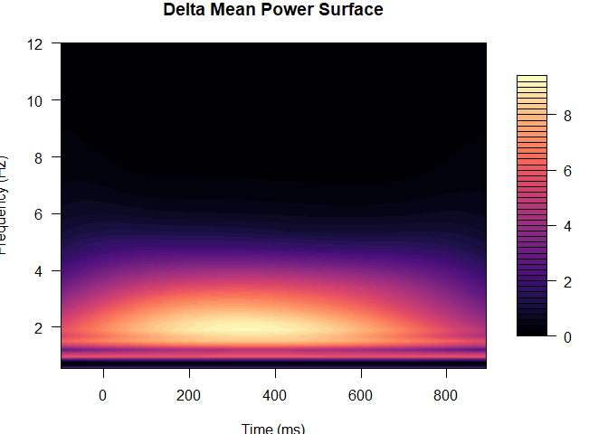<!-- -->

### b. Eigenvector plot


```r
# The following function was modified from the WaveletTransform function found in the
# WaveletComp package. For an in-depth explanation of details involved in the wavelet
# transformation utilized in this function, please refer to the WaveletComp documentation.

# Function to plot eigenvector vector
Eigenvector.plot <- function(Phi,   # Estimated eigenvector, \phi_h (matrix, m x 1)
                             b_d,   # translation (time) parameters, b_d (vector, D x 1)
                             freq,  # Frequency band (Delta, Theta, Alpha, Beta, Gamma) (character)
                             d_tot, # Total number of translation (time) parameters (scalar)
                             f_tot, # Total number of scale (frequency) parameters (scalar)
                             h      # Eigenvector you wish to plot: h = 1,...,H (scalar)
                             ){

  # Determine the scale parameters
  max_freq <- ifelse(freq == "Delta" | freq == "Theta", 12,
                     ifelse(freq == "Alpha", 16, ifelse(freq == "Beta", 32, 64)))
  lowerPeriod <- 1/max_freq
  upperPeriod <- 1/0.5
  omega0 <- 6
  fourier.factor <- (2 * pi)/omega0
  min.scale <- lowerPeriod/fourier.factor
  max.scale <- upperPeriod/fourier.factor
  J <- f_tot - 1 # Total number of voices
  p <- ceiling((J/log2(max.scale/min.scale)*2))/2
  dj <- 1/p
  scales <- min.scale * 2^((0:J) * dj)
  periods <- fourier.factor * scales
  frequencies <- 1/rev(periods) # Frequencies in wavelet transformation

  ## Plot Eigenvector surface
  Eigenvector <- t(matrix(Phi, nrow = f_tot, ncol = d_tot, # Turn eigenvector into surface
                          byrow = T))
  plot.new() # Create new plot
  par(new = "TRUE", plt = c(0.1, 0.8, 0.15, 0.9), las = 1, cex.axis = 1) # Determine location of plot
  filled.contour3(unique(b_d), unique(frequencies), Eigenvector, # Plot eigenvector surface
                  main = paste(freq, "Eigenvector Surface h =", h),
                  color.palette = magma, nlevels = 50, xlab = "Time (ms)",
                  ylab = "Frequency (Hz)", xlim = c(min(b_d), max(b_d)),
                  ylim = c(min(frequencies), max(frequencies)),
                  zlim = c(min(Eigenvector), max(Eigenvector)))
  par(xpd = NA)
  # segments(x0 = 190, y0 = 0.5, y1 = 12, lty = 2, lwd = 2) # Uncomment to add lines that indicate P3 range
  # segments(x0 = 350, y0 = 0.5, y1 = 12, lty = 2, lwd = 2)
  par(new = "TRUE", plt = c(0.85, 0.9, 0.225, 0.825), las = 1, cex.axis = 1) # Determine location of legend
  par(xpd = NA)
  filled.legend(unique(b_d), unique(frequencies), Eigenvector,
                color.palette = magma,
                nlevels = 50, xlab = "", ylab = "",
                xlim = c(min(b_d), max(b_d)),
                ylim = c(min(frequencies), max(frequencies)),
                zlim = c(min(Eigenvector), max(Eigenvector)))

}

# Plot eigenvector
Eigenvector.plot(MDPCA.Sim$Phi[,1],
                 b_d = seq(-100, 896, length.out = 250)[seq(1, 250, by = 4)],
                 freq = "Delta", d_tot = 63, f_tot = 28, h = 1)
```

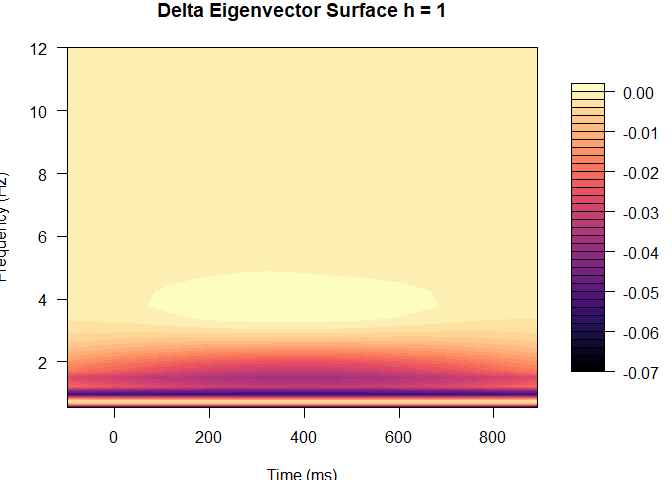<!-- -->

### c. Variance explained plot


```r
# Function to plot variance explained
VarEx.plot <- function(Sigma, # Marginal Covariance matrix, \Sigma (matrix, m x m)
                       freq   # Frequency band (Delta, Theta, Alpha, Beta, Gamma) (character)
                       ){

  # Calculate and create data.frame for variance explained
  VarEx <- eigen(Sigma)$values/sum(eigen(Sigma)$values)*100 # Calculate variance explained
  m <- nrow(Sigma) # Dimension of functional domain
  VarEx <- data.frame(PC = 1:m, VarEx.d = VarEx)
  VarEx <- VarEx[1:20,]

  # Plot varaince explained
  var <- ggplot(data = VarEx, aes(x = PC, y = VarEx.d)) +
    geom_point() + geom_line() + theme_bw() +
    ylab("Variance Explained (%)") +
    ggtitle(paste(freq, "Variance Explained")) +
    scale_x_continuous(name = "Principal Components (h)", breaks = c(5, 10, 15, 20)) +
    theme(panel.grid.major = element_blank(),
          panel.grid.minor = element_blank(),
          panel.background = element_blank(),
          axis.title.x = element_text(size = 15, face = "plain"),
          axis.title.y = element_text(size = 15, face = "plain"),
          axis.text.y   = element_text(size=13, colour = "black"),
          axis.text.x   = element_text(size=13, colour = "black"))
  var
}

# Plot variance explained from simulated data
VarEx.plot(Sigma = MDPCA.Sim$XX, freq <- 'Delta')
```

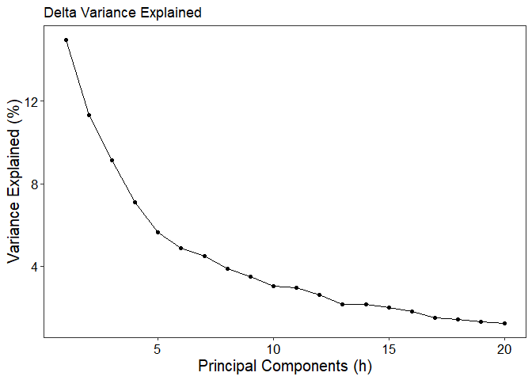<!-- -->

### d. Group-level estimated and true mean MDPCA score trajectories plot


```r
# Define subgroup identifiers
group.indices <- list(c(1:5), c(1:5, 7, 16:19), c(1:5, 8, 20:23), # Indices for groups identification in ME model
                      c(1:5, 7, 16:19, 8, 20:23, 11, 33:36),
                      c(1:5, 6, 12:15), c(1:5, 6, 12:15, 7, 16:19, 9, 25:28),
                      c(1:5, 6, 12:15, 8, 20:23, 10, 29:32),
                      c(1:5, 6, 12:15, 7, 16:19, 8, 20:23, 9, 25:28, 10,
                        29:32, 11, 33:36, 24, 37:40))
group.id <- list(c("ASD", "Expected", "Frontal"), # Associated group to the above indices g = 8
                 c("ASD", "Unexpected", "Frontal"),
                 c("ASD", "Expected", "Posterior"),
                 c("ASD", "Unexpected", "Posterior"),
                 c("TD", "Expected", "Frontal"),
                 c("TD", "Unexpected", "Frontal"),
                 c("TD", "Expected", "Posterior"),
                 c("TD", "Unexpected", "Posterior"))

# Function to plot estimates
plot.func <- function(group,     # group (ASD/TD) (character)
                      condition, # experimental condition (Expected/Unexpected) (character)
                      lobe,      # scalp section (Frontal/Posterior) (character)
                      s,         # longitudinal domain grid (vector)
                      MEmodel,   # list() of the lme results calculated using the function LTFT.ERP_MixedEffectsModel.R
                      legend,     # legend.position as detailed in ggplot2 package (vector)
                      n.spline  # number of spline knot used in longitudinal modeling (scalar)
                      ){

  # Create splines matrix
  spline <- as.data.frame(cbind(s, ns(s, df = n.spline)))
  names(spline) <- c("trial", paste("spline", 1:n.spline, sep = ""))
  X.form <- cbind(rep(1, length(s)), spline[,2:(n.spline + 1)])

  # Coefficients and estimates
  fit.beta <- MEmodel$B[[1]]


  # Calculate estimated group effects
  groupid <- if_else(
    group == "ASD" & condition == "Expected" & lobe == "Frontal", 1, if_else(
      group == "ASD" & condition == "Unexpected" & lobe == "Frontal", 2,
      if_else(group == "ASD" & condition == "Expected" & lobe == "Posterior",
              3, if_else(
                group == "ASD" & condition == "Unexpected" &
                  lobe == "Posterior", 4, if_else(
                    group == "TD" & condition == "Expected" &
                      lobe == "Frontal", 5, if_else(
                        group == "TD" & condition == "Unexpected" &
                          lobe == "Frontal", 6, if_else(
                            group == "TD" & condition == "Expected" &
                              lobe == "Posterior", 7, 8)))))))
  group.ind <- unlist(group.indices[[groupid]])
  qo <- length(group.ind)/(n.spline + 1)
  fit.est <- rep(0, (n.spline + 1))
  for(i in 1:qo){
    fit.est <- fit.est + fit.beta[
      group.ind[((n.spline + 1)*i - n.spline):((n.spline + 1)*i)]] # Estimated fixed effects
      }

  fit.est <- as.vector(fit.est %*% t(X.form))

  # Determine true mean MDPCA score trajectories
  beta.true <- fixed.effects[[1]]
  fit.true <- rep(0, (n.spline + 1))
  for(i in 1:qo){
    fit.true <- fit.true + beta.true[
      group.ind[((n.spline + 1)*i - n.spline):((n.spline + 1)*i)]]

  }
  fit.true <- as.vector(fit.true %*% t(X.form))

  # Create data frame for plot
  data <- data.table(trial = s, group, condition, lobe, fit.est, fit.true)

  # Determine that the estimated mean MDPCA score trajectory is in the correct direction
  if(sum(abs(data$fit.true - -1*data$fit.est))/sum(abs(data$fit.true)) <=
     sum(abs(data$fit.true - data$fit.est))/sum(abs(data$fit.true))) {
    data$fit.est <- -1*data$fit.est
    data$fit.lower <- -1*data$fit.lower
    data$fit.upper <- -1*data$fit.upper
  }

  # Format plot data
  data <- data %>%
    select(trial, fit.true, fit.est) %>%
    melt(id.vars = "trial") %>%
    mutate(lty = if_else(variable == "fit.true", "True", "Estimate"))

  # Plot the estimated and true mean MDPCA score trajectories
  plot <- ggplot(data = data, aes(x = trial, y = value, lty = lty)) +
      geom_line(size = 1) + theme_bw() +
      ylab("MDPCA Scores") + xlab("Trial") +
      scale_linetype_manual(values = c(3, 1)) +
      ggtitle(paste(group, condition, lobe)) +
      theme(panel.grid.major = element_blank(),
            panel.grid.minor = element_blank(),
            panel.background = element_blank(),
            legend.title = element_blank(),
            plot.title = element_text(hjust = 0.5, size = 17,
                                      margin=margin(0,0,10,0)),
            axis.title.x = element_text(size = 13, face = "plain"),
            axis.title.y = element_text(size = 13, face = "plain"),
            axis.text.y   = element_text(size=11, colour = "black"),
            axis.text.x   = element_text(size=11, colour = "black"),
            legend.text = element_text(size = 11),
            panel.border = element_rect(fill=NA, size=1),
            legend.position = legend,
            legend.key = element_rect(),
            legend.background = element_blank()) +
      theme(plot.margin = unit(c(3,3,3,3), "mm")) +
      scale_x_continuous(limits = c(5, 80), expand = c(0, 0),
                         breaks = c(5, 20, 40, 60, 80))

  return(plot)
}

par(mfrow = c(2, 4))
plot.func(group = "ASD", condition = "Expected", lobe = "Frontal", s = 5:80, fit.Sim, c(0.2, 0.85), 4)
```

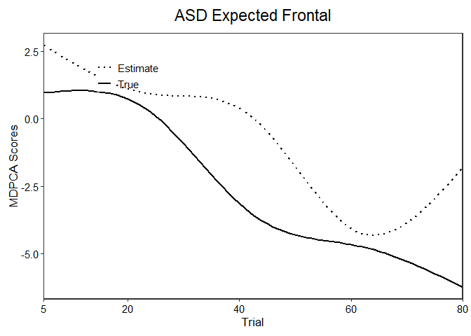<!-- -->

```r
plot.func(group = "ASD", condition = "Unexpected", lobe = "Frontal", s = 5:80, fit.Sim, c(0.2, 0.85), 4)
```

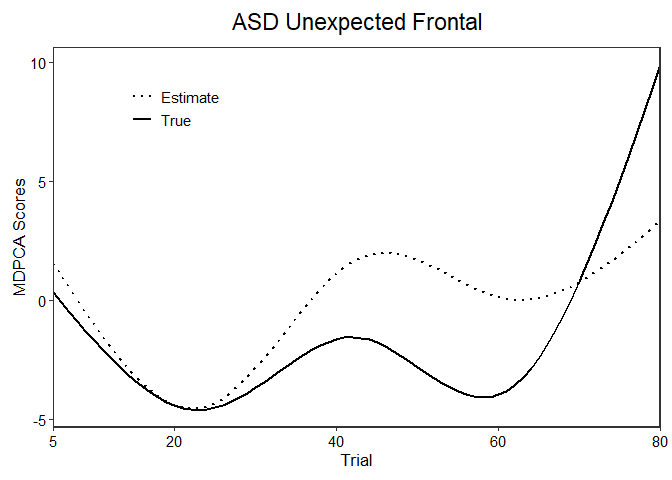<!-- -->

```r
plot.func(group = "TD", condition = "Expected", lobe = "Frontal", s = 5:80, fit.Sim, c(0.2, 0.85), 4)
```

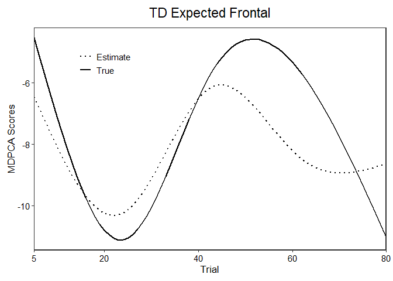<!-- -->

```r
plot.func(group = "TD", condition = "Unexpected", lobe = "Frontal", s = 5:80, fit.Sim, c(0.2, 0.85), 4)
```

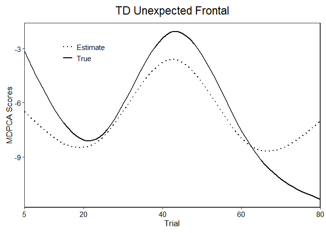<!-- -->

```r
plot.func(group = "ASD", condition = "Expected", lobe = "Posterior", s = 5:80, fit.Sim, c(0.2, 0.85), 4)
```

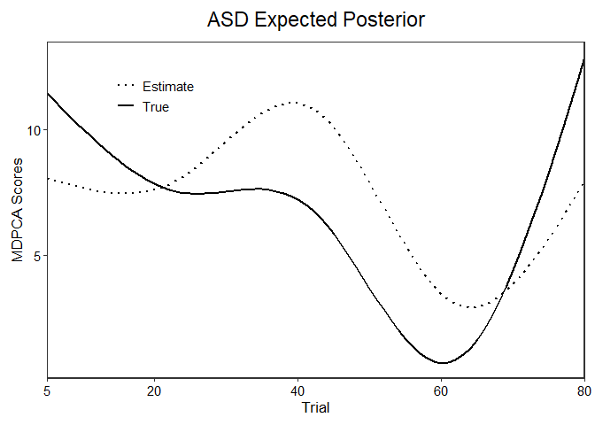<!-- -->

```r
plot.func(group = "ASD", condition = "Unexpected", lobe = "Posterior", s = 5:80, fit.Sim, c(0.2, 0.85), 4)
```

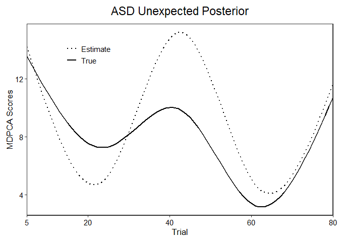<!-- -->

```r
plot.func(group = "TD", condition = "Expected", lobe = "Posterior", s = 5:80, fit.Sim, c(0.2, 0.85), 4)
```

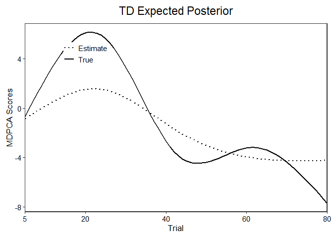<!-- -->

```r
plot.func(group = "TD", condition = "Unexpected", lobe = "Posterior", s = 5:80, fit.Sim, c(0.2, 0.85), 4)
```

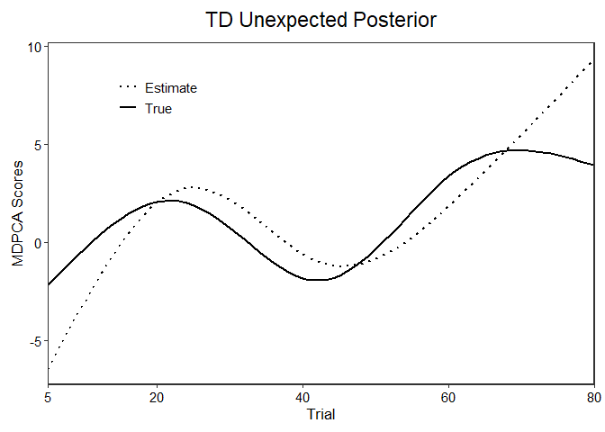<!-- -->

